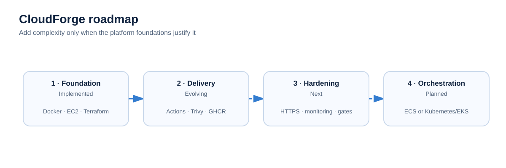

# CloudForge

**Build · Automate · Secure · Deploy · Scale**

CloudForge is a hands-on AWS platform engineering project built to take an application from local development to repeatable cloud deployment using infrastructure as code, containers, automated validation and CI/CD.


## Why I built CloudForge

I wanted to move beyond learning individual cloud and DevOps tools in isolation. CloudForge gives me one project where infrastructure, application delivery, security checks and troubleshooting have to work together.

It started with a containerised application and an EC2 deployment. I then expanded the project with Terraform-managed AWS infrastructure, GitHub Actions, environment separation, container publishing, static analysis and vulnerability scanning.

The goal is not to collect tools. Each addition should solve an engineering problem: repeatability, safer changes, environment isolation, deployment consistency, security or observability.

## Platform at a glance

| Area | Implementation |
|---|---|
| Cloud | AWS |
| Infrastructure as Code | Terraform |
| Containers | Docker / Docker Compose |
| Application | Ghost + MySQL |
| CI/CD | GitHub Actions |
| Registry | GitHub Container Registry (GHCR) |
| IaC quality | terraform fmt, validate, TFLint |
| Security | Trivy |
| Runtime | Linux / EC2 |
| Environments | dev, staging, prod configuration |

## Delivery workflow


Changes are developed in Git, checked through automated workflows, built as container images and prepared for deployment. Infrastructure changes are validated before they are accepted.

### Quality gates

1. `terraform fmt -check`
2. `terraform validate`
3. `tflint`
4. Trivy security scan
5. Docker build
6. Publish versioned image to GHCR
7. Deploy to the target environment when the deployment path is enabled

A failed gate should stop the change rather than allowing a broken configuration to move further through the delivery process.

## Environments


**Development** is used for feature work and infrastructure testing. **Staging** is intended for pre-production validation. **Production** represents the stable target configuration. Stronger production approval and environment protection are part of the platform-hardening roadmap until configured and tested.

## Engineering journey


CloudForge has been built incrementally. That matters because the project records not only the working configuration, but also the engineering problems encountered while connecting the individual components.

### Problems solved

**SSH deployment authentication**  
A GitHub Actions deployment reached the deployment stage but could not authenticate to EC2. I worked through the key configuration and server-side `authorized_keys` setup and restored the SSH deployment path.

**Terraform CI workflow**  
A workflow failed because of YAML structure and indentation. After isolating the workflow issue and correcting it, Terraform formatting, validation and TFLint checks completed successfully.

These failures reinforced a simple troubleshooting principle: identify the failing layer, collect evidence from that layer, change one thing at a time, then rerun the same check.

## Security approach


CloudForge treats security checks as part of delivery rather than a final manual task. Secrets and private keys must stay outside source control. Trivy provides vulnerability scanning, TFLint checks Terraform configuration, and AWS network access should be restricted to what the workload requires.

See [Security](docs/security.md) for the project rules.

## Repository map

```text
aws-cloudforge-platform/
├── .github/
│   ├── workflows/              # CI/CD and validation workflows
│   ├── instructions/           # Path-specific repository guidance
│   ├── copilot-instructions.md # Engineering context for coding assistants
│   └── PULL_REQUEST_TEMPLATE.md
├── app/                        # Application code (existing project)
├── terraform/                  # Infrastructure as code (existing project)
├── docs/                       # Architecture and operating documentation
├── diagrams/                   # Editable SVG architecture/process diagrams
├── scripts/                    # Utility scripts
├── compose.yaml                # Existing Compose definition
├── Dockerfile                  # Existing container definition
└── README.md
```

> This documentation package is designed to sit alongside the existing CloudForge application, Terraform and workflow files. Do not overwrite working infrastructure files without reviewing the diff first.

## Documentation

- [Architecture](docs/architecture.md)
- [CI/CD](docs/ci-cd.md)
- [Environments](docs/environments.md)
- [Security](docs/security.md)
- [Engineering journey](docs/journey.md)
- [Troubleshooting](docs/troubleshooting.md)
- [Design decisions](docs/decisions.md)
- [Roadmap](docs/roadmap.md)
- [Getting started](docs/getting-started.md)

## Roadmap

CloudForge is intentionally incremental. Current documentation distinguishes between what has been implemented and what is planned.

**Platform hardening:** environment promotion, GitHub environment protection, HTTPS/DNS, CloudWatch monitoring and alerts, improved secrets handling and reusable Terraform patterns.

**Orchestration:** container orchestration is a later phase. Kubernetes/EKS or ECS should only be marked implemented after the deployment exists and has been tested.



## Engineering principles

- Infrastructure changes belong in version control.
- Never commit credentials, private keys or real `.env` secrets.
- Automated checks should fail fast.
- Production controls should be stronger than development controls.
- Documentation and diagrams should match the current implementation.
- Planned features must be labelled as planned.
- Prefer understandable infrastructure over unnecessary complexity.

## Design reference

The repository also contains `diagrams/cloudforge-readme-concept.png`, a visual concept for the documentation system. The SVG diagrams in this repository are the maintainable GitHub-native versions.

---

**CloudForge** is an evolving engineering project. The repository is intended to show the platform, the decisions behind it, the problems encountered while building it, and the improvements still to come.
