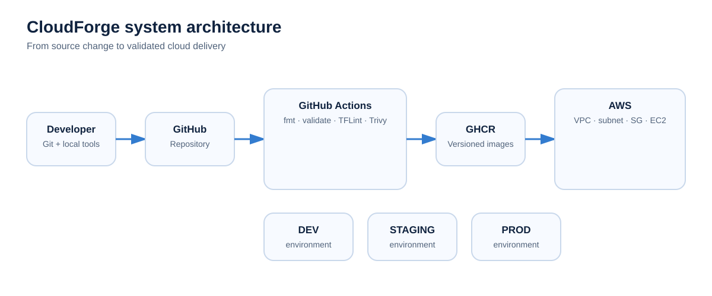

# Architecture

CloudForge connects source control, automated validation, container delivery and AWS infrastructure into one learning platform.

## Flow

1. A change is developed locally and pushed to GitHub.
2. GitHub Actions runs the relevant quality and security checks.
3. Terraform changes are formatted, validated and linted.
4. Application/container changes can be scanned and built.
5. Versioned images are published to GHCR when the build workflow is enabled.
6. The deployment path targets AWS infrastructure managed by Terraform.
7. Environment-specific configuration separates dev, staging and production concerns.

## AWS layer

The Terraform work has covered a VPC, public subnet, internet gateway, routing, security groups and EC2. The project uses the London AWS region (`eu-west-2`).

## Application layer

The containerised application work includes Ghost and MySQL through Docker Compose with persistent storage. Application health, HTTPS, DNS and deeper monitoring should only be shown as current once they are implemented and verified.
