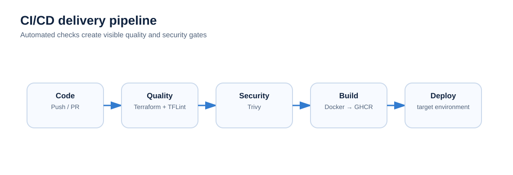

# CI/CD

CloudForge uses GitHub Actions to turn repository changes into repeatable checks and build/deployment steps.

## Pull-request checks

Terraform changes should pass formatting, validation and linting. Trivy provides security scanning. These checks are intended to stop obvious defects before merge.

## Container delivery

Docker images can be built in CI and published to GitHub Container Registry (GHCR). Versioned tags make releases traceable instead of relying only on `latest`.

## Deployment controls

Development automation can be permissive while production should require stronger controls. Manual production approval is a planned control until GitHub environment protection has been configured and tested in this repository.

## Failure behaviour

A failed validation or scan should fail the job. Do not bypass a gate merely to obtain a green workflow run; investigate the cause and document exceptions when they are genuinely required.
