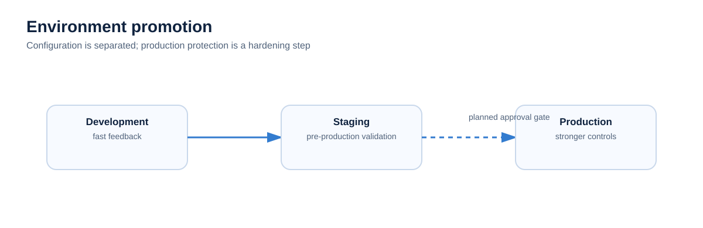

# Environments

CloudForge separates environment-specific configuration so the same platform pattern can evolve across development, staging and production.

## Development

Used for active infrastructure/application changes and early deployment testing.

## Staging

Used to validate a release candidate before production. Keep staging close enough to production to expose configuration differences.

## Production

Represents the stable target. Production approval, protected environments, monitoring and stronger operational controls are part of the hardening roadmap until implemented.
