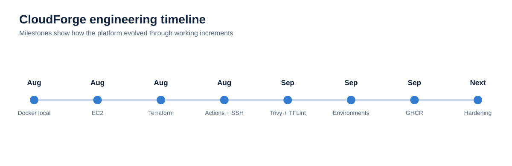

# Engineering Journey

CloudForge grew through small working increments rather than a single large build.

## August 2026

- Containerised application running locally.
- First EC2 deployment in AWS.
- Terraform networking and EC2 infrastructure introduced.
- GitHub Actions deployment workflow developed.
- SSH authentication issue investigated and corrected.
- Ghost + MySQL Compose stack added with persistent storage.

## September 2026

- Trivy security scanning added.
- Terraform CI introduced with formatting, validation and TFLint.
- Workflow YAML issue diagnosed and corrected.
- Multiple Terraform environments/configuration developed.
- GHCR image build/publish work added with versioned image strategy.
- Deployment workflow continued through live troubleshooting.

## Next phase

Platform hardening comes before adding orchestration for its own sake: environment controls, HTTPS/DNS, monitoring, alerting and a cleaner promotion model. Kubernetes/EKS or ECS can follow when there is a clear operational reason for it.
