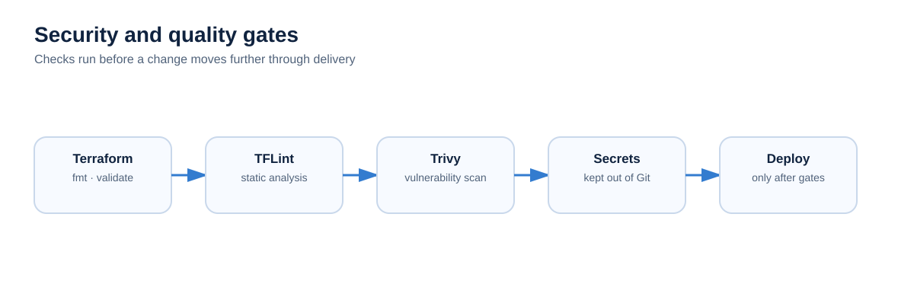

# Security

Security controls should be visible in the normal engineering workflow.

## Repository rules

- Never commit AWS credentials, SSH private keys or real application secrets.
- Keep `.env` files ignored and provide `.env.example` with placeholders only.
- Use GitHub Secrets or environment secrets for deployment credentials.
- Restrict SSH ingress to the required CIDR rather than `0.0.0.0/0`.
- Review Trivy findings rather than treating the scan as a badge generator.
- Validate Terraform before deployment.
- Use least privilege when IAM is introduced or expanded.

## Planned hardening

GitHub environment protection, HTTPS, DNS, CloudWatch monitoring/alerts and improved secret handling should be moved from planned to current only after they are configured and verified.
